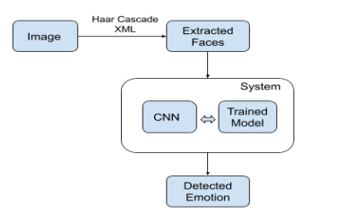

# EmotionRecognition

## Project 3 Group 3
### Name:
- Abinaya Ramachandran
-	Krina Patel
-	Yunwei Chang
### Email: 
- aramachandran4@horizon.csueastbay.edu
- kpatel107@horizon.csueastbay.edu
- ychang52@horizon.csueastbay.edu
       
## Section 1 Execution Instructions:
Instructions to download and run code 

- screen shot of github “Emotion Recognition”  

- directory view of "temp" directory you unzipped file to show the unzipped files and directory structures

- Instructions on importing the project onto Github

- copy github HTTP link 

- Click on Git and clone the github repository

- import github HTTP address

- Click on Git and go to “Branches”

- click on “origin/master” under remote Branches then click on “Checkout”

- click on “master” under Local Branches and click on “Update”

- download and copy the “google-services.json” file

- Right click on app folder and paste the “google-services.json” file into app folder

- Click run and run the application again

## Section 2 Code Description

### Google Colab
- The colab contains python code which first mounts the google drive and downloads the AffectNet dataset to do emotion recognition.
- After the dataset is downloaded, it starts preprocessing of data. The images are cropped to focus on only the face. The face detection is done by Haar Cascade Classification, after that the image is cropped and resized to 512x512 pixels. 
- Then the class labels are provided to each image belonging to different classes. Now the training is done by tensorflow keras CNN classifier. Model parameters are set and the sequential model is compiled.
- Finally the model is saved as a tflite file and then imported into the android application.

### Android Application
To detect faces on an image the application uses ML Kit. After that the face is fed to the TensorFlow Light convolutional neural network model. The model provides output that consist of probabilities for each class: angry, disgust, fear, happy, neutral, sad, surprise.
1. Build.Gradle
- We have included the ML KIT dependencies and Tensorflow light libraries.
- The file: google-services.json is copied in the app to add the ‘gms-google-services’ plugin. 
- After that, build.gradle is ready to get build and get synced.

2. Designing the UI
- AndroidManifest.xml -> The AndroidManifest.xml file contains important metadata about the Emotion Recognition app. This includes the package name, activity names, main activity, launch activity which is the entry point to the app, Android version support, hardware features support, read/write permissions codes and other configurations.
- activity main.xml -> activity_main.xml file determines the look of the main activity which is the front page of the app. It contains two button components to take a picture or upload an existing picture.
- Expandable_list_group_classification.xml -> This file has been created to customize the output screen, which will display the output image with bounding box and a Result Dialog box with a text view called Result Text with all the attributes of the detected image. 

3. Java classes 
- Utils/Imageutils.java -> Utility class for image analysis and processing. It contains util functions to help process the images like changing the image orientation and setting the color modes. The functions check whether a bitmap is grayscale, convert a drawable to a bitmap and scale it to fit within maxWidth and maxHeight. It loads a bitmap, and attempts to downscale to the required size, to save on memory. 
- Utils/Sorting Helper -> Helper Class contains helper functions which do sorting. This Class intends to give quick implementation of basic functions such that for every output image, it sorts the output probabilities in decreasing order.
- MainActivity.java -> The mainActivity file contains the main user interface code. It has functions to take picture or upload picture from gallery. The next step is  MLKit firebase functions to detect faces from picture and finally it draws bounding box around the face.
- TfliteClassifier.java -> It is the abstract file for tflite classifier. It sets up the tflite interpreter by loading the provided model.
- TfliteImageClassifier ->  This file does preprocessing of images like converting image to bitmap and tensor image. After preprocessing, it passes the image to the classifier model.
- InterpreterImageparams -> This file sets the parameters of input and output. These parameters are required to run the classifier model precisely.

## Section 3 Testing:
 here you give screen shots of you running the various stages of the program as detailed here:
### section 3.1: starting application

### section 3.2: use-step 1    
you need to discuss your results….discuss the steps involved in using the Android application including how the image or images are taken using the Android camera and the results.
The result of our facial recognition is that the mobile application would classify the facial expression as one of the 6 classes (happy, sad, fear, neutral, disgust, and angry). It will rank the facial expression with the highest probability on top and the lowest probability on the bottom. It will also show the percentage of the likelihood of the facial expression. 
There are two ways to import images. Once is by taking a live photo. Another is by importing an image in the gallery. Then, the application would determine the likelihood of the facial expression by percentage. 

## Section 4 Comments on what is not working:
We are not able to find facial expressions in real time video. At the same time, we are not able to identify facial expressions when there are multiple faces in the image.

## Section 5 YOUTUBE URL - URL to YouTube video: and it must go over a LIVE demonstration of the program working and describe what is working, what is not working, and how well it works (accuracy --e.g. 2/10 times, never, 9/10 times whatever)

